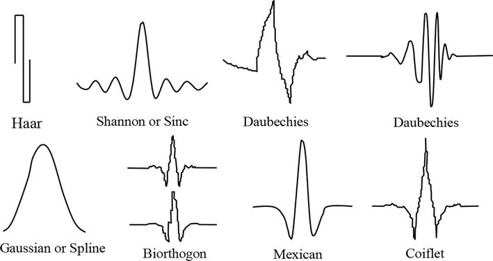
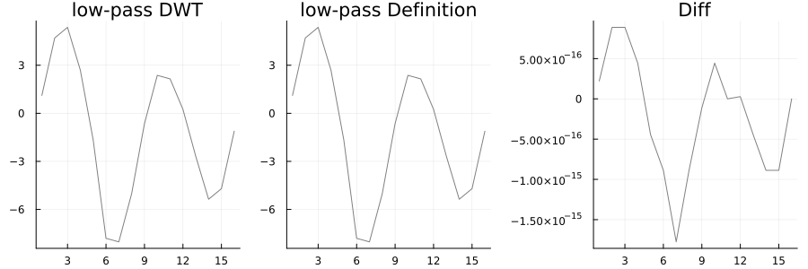
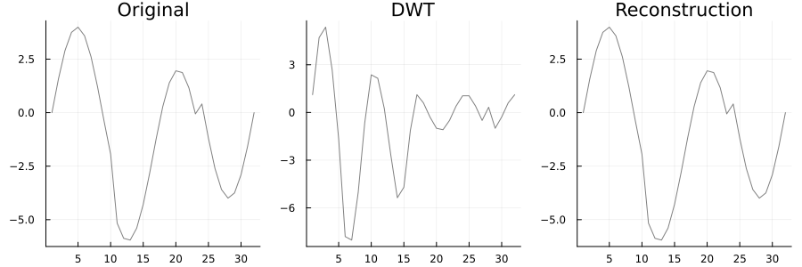
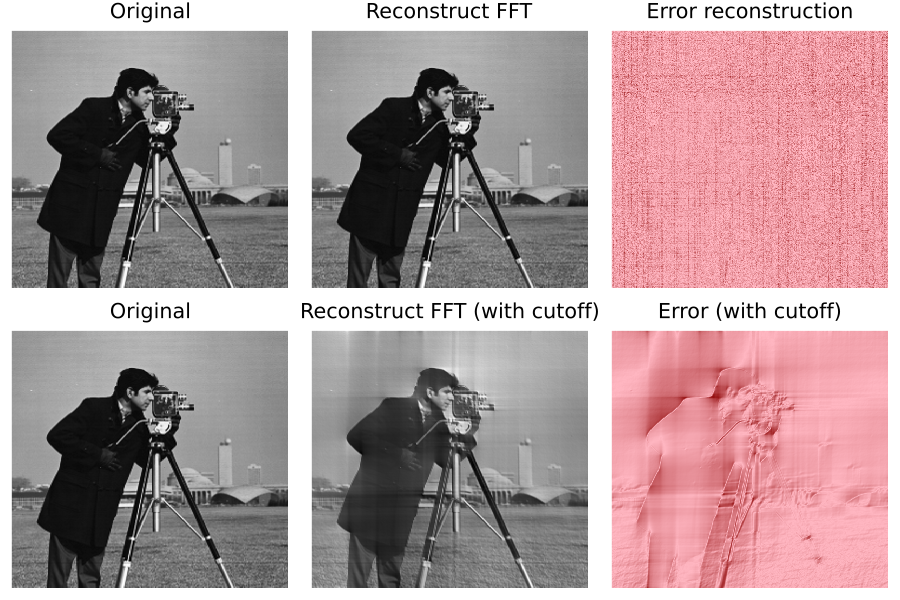
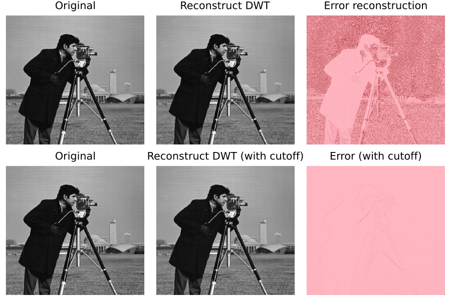
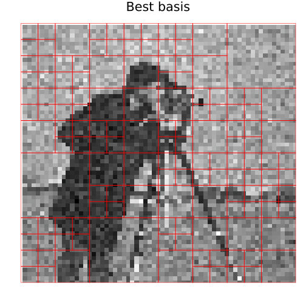
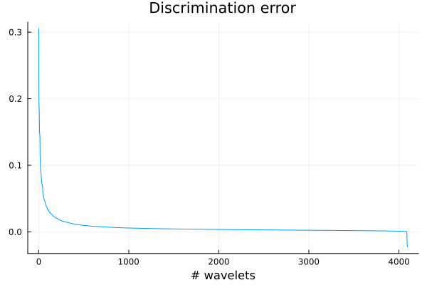
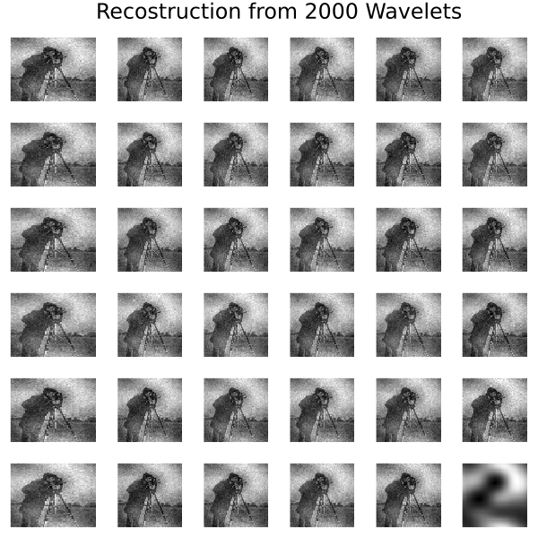
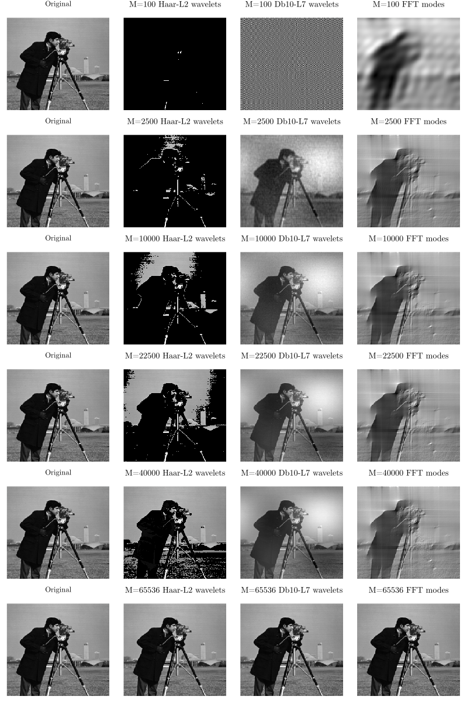

# Wavelet formulation of neural closure models for the incompressible Navier-Stokes equations

## Discrete wavelet transform

Wavelet transforms provide a powerful alternative to Fourier transforms for analyzing signals in both time and frequency domains.
While Fourier transforms represent signals as sums of sinusoidal functions with constant frequency over time, wavelet transforms offer a more localized representation, capturing both frequency and temporal information simultaneously.

The discretized version of Wavelet transforms offer a powerful alternative to Fourier transforms, especially when dealing with 2D static images. In brief, while Fourier transforms are designed to represent signals in the frequency domain, they may struggle with localized features and abrupt changes in the pixel values. Wavelet transforms, on the other hand, excel in capturing such abrupt changes.

In this section, I want to introduce the discrete pseudo-wavelet space where only the spacial dependence of a function $u(x,t)$ is described in the wavelet space, in the same fashion as pseudo-spectal methods.

In essence, wavelet transforms decompose the function into its constituent components by using wavelet functions $\psi_{jk}$:
$$
\begin{align}
u(x,t) = \sum_{j\in\mathbb{Z},k \in \mathbb{Z}} \hat{u}_{jk}(t) \psi_{jk}(x),
\end{align}
$$
where $\hat{u}_{jk}(t)$ are the (time-dependent) coefficients that represent $u$ on this (redundant) base. All the $\psi_{jk}$ wavelets, are constructed using dyadic translations and dilatations of a mother wavelet $\psi(x)$ as follows:

$$
\begin{align}
\psi_{jk} &= 2^{-\frac{j}{2}}\psi(2^{-j} x-k).
\end{align}
$$
If $\psi$ was a sinusoidal wave, due to its periodicity, it would not make much sense to introduce a secondary index like $k$, while all the base element could be characterized by a single index, representing the frequency. Instead, the mother wavelet is a non-periodic function, that is selected among a well-established library like the following:


At this point we can understand the role of the indexes in $\psi_{jk}$:
* $j$ is the *scaling*:   $\psi_{j+1,k}$ corresponds to $\psi_{j,k}$ stretched by a factor $2$,
* $k$ is the *shifting*:   $\psi_{j,k+1}$ corresponds to $\psi_{j,k}$ one grid step to the right.

So, unlike the global nature of Fourier transforms, wavelets offer a localized representation that is particularly beneficial for extracting information from specific regions and details. This property makes wavelet transforms especially suitable for tasks such as image compression, denoising, and feature extraction.

However, the representation of eq.1 is not efficient, because (i) it is unboudned in $k$ and $j$, (ii) the wavelets at different level overlaps (so they are not a proper base) and (iii) the information is not sparse. These problesm can be solved with the introduction of multiresolution analysis (MRA)[^1]. In this notebook I will not give a proper introduction nor a general explanation to MRA, but I will only show you how it can be useful.

Briefly, in MRA we use a pyramidal decomposition on the signals onto a basis of orthonormal wavelets that progressively filter the data to accumulate information in an optimal way. Notice that this base will not only be signal-dependent, but it will also depend on:
* the specific choice of the mother wavelet
* the number of resolution scales to include in the analysis
* the discretization of the data

Luckily for us, the necessary operation are aleady implemented in modern packages like `Wavelets.jl`. In the next section, we will discuss some practical example and applications.

### Information in the wavelet coefficients

We will look here at a specific wavelet representation that hopefully will be helpful to understand the idea behind DWT.

Load Pkg

```julia
using Pkg
Pkg.add("Wavelets")
Pkg.add("WaveletsExt")
Pkg.add("TestImages")
Pkg.add("ImageIO")
Pkg.add("Plots")
Pkg.add("LinearAlgebra")
using TestImages, ImageIO, LinearAlgebra, Plots, Wavelets, WaveletsExt, Statistics
```

For this example, let's use Haar wavelet (step-function) defined as

$$
\psi(t) =
\begin{cases}
1, & \text{if } 0 \leq t < \frac{1}{2} \\
-1, & \text{if } \frac{1}{2} \leq t < 1 \\
0, & \text{otherwise}
\end{cases}
$$
whose constructor is available in Wavelet.jl as

```julia
wt = wavelet(WT.haar)
```

We now generate 1D data

```julia
X = generatesignals(:heavisine, 5)
```

We then set the number of resolution scales that we want to use

```julia
L = 1
```

Notice that this number is limited by the Nyquist criterion to

```julia
Lmax = maxtransformlevels(X)
```

We apply the DWT alogorithm

```julia
Y = dwt(X, wt, L);
```

The output of L=1 DWT is a vector with the same lenght as X

```julia
length(X) == length(Y)
```

The definition of Y is specific for each wavelet and MRA level, and it is usually analitally calculated in the continuous limit [^1]. Such derivation is out of the scope of this notebook, where I will assume that the rules to perform DWT are available in the preferred softwares. For the specific case of Haar L=1 wavelets, I want to show you that the first half of the transformed signal Y is defined as
$$
Y_{i=1,...N/2} = \frac{X_{2i-1} + X_{2i}}{\sqrt{2}},
$$
as we can also confirm below

```julia
Y_low = Y[1:Int(end/2)]
Y_definition = [X[i] + X[i+1] for i in 1:2:length(X)-1]/sqrt(2)
definition_error = Y_low-Y_definition
p0 = plot(Y_low, color=:grey, legend=false )
p1 = plot(Y_definition, color=:grey, legend=false )
p2 = plot(definition_error, color=:grey, legend=false )
plot(p0, p1, p2, layout=(1, 3), title=["low-pass DWT" "low-pass Definition" "Diff"], size=(900,300))
savefig("assets/lowpass.png")
```



So, for the L=1 Haar DWT, this first half of Y is the average of the signal X (except for a factor $\sqrt{2}$). The first part of Y is also called the low-pass, because it is constructed to resonate with the low frequency part of the signal (the pseudo-average does this). We can already see that DWT is trying to localize the low-frequency information in the first part of this transformed signal Y.

The second part of Y, or respectively the high-pass, is defined for the specific Haar L=1 DWT to be
$$
Y_{i=1,...N/2} = \frac{-X_{2i-1} + X_{2i+1}}{\sqrt{2}},
$$
as we can also confirm below

```julia
Y_high = Y[Int(end/2)+1:end]
Y_definition = [-X[i] + X[i+1] for i in 1:2:length(X)-1]/sqrt(2)
definition_error = Y_high-Y_definition
p0 = plot(Y_high, color=:grey, legend=false )
p1 = plot(Y_definition, color=:grey, legend=false )
p2 = plot(definition_error, color=:grey, legend=false )
plot(p0, p1, p2, layout=(1, 3), title=["high-pass DWT" "high-pass Definition" "Diff"], size=(900,300))
savefig("assets/highpass.png")
```


This defintion of the high-pass part resembles the difference between two consecutive elements of X. So, overall we can say that *L=1 Haar* is storing the information of X into a signal Y, where:
* the first half of Y corresponds to the running 'averages' of X,
* the second half of Y corresponds to the 'details' that we can use to reconstruct the original elements of X .

Finally let's look at how efficiently the signal is reconstructed from Y

```julia
X_rec = idwt(Y, wt, L);
p0 = plot(X, color=:grey, legend=false )
p1 = plot(Y, color=:grey, legend=false )
p2 = plot(X_rec, color=:grey, legend=false )
plot(p0, p1, p2, layout=(1, 3), title=["Original" "DWT" "Reconstruction"], size=(900,300))
savefig("assets/1dL1haar.png")
```



notice also how in Y the largest fluctuations are confined to the first part.

#### Deeper DWT (L>1)

We have just discussed how L=1 DWT works in the specific case of Haar wavelets. The next step is to understand how deeper transformations are performed in the pyramidal MRA scheme.
The general idea of MRA, is to compress even more the low-frequency part, by applying the same transformation as L=1, but only on the 'average' (the low-pass) part. The pyramidal structure of this algorithm is well illustrated in the figure:


where we see the iterative structure of the L>1 DWT. The figure above in particular is showing the end result of Y for a L=3 DWT. You can see in the end the dyadic structure of Y, where the lowest frequencies is compressed in just Y[1:2], while the remainder of Y are the high frequency details to reconstruct X pyramidally.

To convince you a bit more about this pyramidal structure, I will explicitely look at the definition of the 'average' (low-pass) part at L=2

```julia
L = 1
Y1 = dwt(X, wt, L);
L = 2
Y2 = dwt(X, wt, L);
Y1_low = Y1[1:Int(end/2)]
Y2_low = Y2[1:Int(end/4)]
```

we define the lowpass filter in the same way that we did for L=1

```julia
Y2_definition = [Y1[i] + Y1[i+1] for i in 1:2:length(Y1_low)-1]/sqrt(2)
p0 = plot(Y1_low, color=:grey, legend=false )
p1 = plot(Y2_low, color=:grey, legend=false )
p2 = plot(Y2_definition, color=:grey, legend=false )
plot(p0, p1, p2, layout=(1, 3), title=["low-pass L1 DWT" "low-pass L2 DWT" "low-pass L2 Definition"], size=(900,300))
savefig("assets/l2lowpass.png")
```


At this point, it is not difficult to understand the full pyramidal structure of DWT, once the structrue for the L=1 level is known.

The final example that I want to report is about 2D data. The only difference in 2D is that row and columns are transformed separately, so we get the following structure:


### Dimensionality reduction with wavelets

We now show how the wavelet representation is efficient in comspressing information.

Load data

```julia
ximg = testimage("cameraman");
X = convert(Array{Float64}, ximg);
```

First we look at a standard FFT approach for comparison

```julia
Pkg.add("AbstractFFTs")
using AbstractFFTs
```

FFT transform

```julia
Xk = fft(X)
```

and invert

```julia
Xrec = real.(ifft(Xk))
```

In FFT, the coefficents of the transform Xk are the projection of X on the discrete Fourier basis. While this has computational advantages (we will see later), it also means that the information is stored per global frequency bands. To understand what it means, let's remove the entire high frequency part of standard FFT

```julia
Xk_cut = copy(Xk)
```

cut the high frequency modes

```julia
Xk_cut[Int(end/2):end, Int(end/2):end] .= 0
```

and invert

```julia
Xrec_cut = real.(ifft(Xk_cut))
```

Compute the reconstruction error

```julia
reconstruction_error = abs.(X-Xrec)
reconstruction_error_cut = abs.(X-Xrec_cut)
```

and finally we plot the results

```julia
p0 = heatmap(X, yflip=true, color=:greys, legend=false, xaxis=false, yaxis=false, xticks=false, yticks=false);
p1 = heatmap(Xrec, yflip=true, color=:greys, legend=false, xaxis=false, yaxis=false, xticks=false, yticks=false);
p2 = heatmap(reconstruction_error, yflip=true, color=:reds, legend=false, xaxis=false, yaxis=false, xticks=false, yticks=false);
p3 = heatmap(Xrec_cut, yflip=true, color=:greys, legend=false, xaxis=false, yaxis=false, xticks=false, yticks=false);
p4 = heatmap(reconstruction_error_cut, yflip=true, color=:reds, legend=false, xaxis=false, yaxis=false, xticks=false, yticks=false);
plot(p0, p1, p2, p0, p3, p4, layout=(2,3), title=["Original" "Reconstruct FFT" "Error reconstruction" "Original" "Reconstruct FFT (with cutoff)" "Error (with cutoff)"], size=(900,600))
savefig("assets/fourier_cut.png")
```



So if we cut the highest frequency modes of FFT, we get some visible error bands.

Now let's do the same thing with our L=1 Haar DWT

```julia
wt = wavelet(WT.haar)
L = 1
Xk = dwt(X, wt, L);
Xrec = idwt(Xk, wt, L);
```

and also remove the high frequency part of the MRA

```julia
Xk_cut = copy(Xk)
Xk_cut[Int(end/2):end, Int(end/2):end] .= 0
Xrec_cut = idwt(Xk_cut, wt, L)
```

and plot the comparison

```julia
reconstruction_error = abs.(X-Xrec)
reconstruction_error_cut = abs.(X-Xrec_cut)
p0 = heatmap(X, yflip=true, color=:greys, legend=false, xaxis=false, yaxis=false, xticks=false, yticks=false);
p1 = heatmap(Xrec, yflip=true, color=:greys, legend=false, xaxis=false, yaxis=false, xticks=false, yticks=false);
p2 = heatmap(reconstruction_error, yflip=true, color=:reds, legend=false, xaxis=false, yaxis=false, xticks=false, yticks=false);
p3 = heatmap(Xrec_cut, yflip=true, color=:greys, legend=false, xaxis=false, yaxis=false, xticks=false, yticks=false);
p4 = heatmap(reconstruction_error_cut, yflip=true, color=:reds, legend=false, xaxis=false, yaxis=false, xticks=false, yticks=false);
plot(p0, p1, p2, p0, p3, p4, layout=(2,3), title=["Original" "Reconstruct DWT" "Error reconstruction" "Original" "Reconstruct DWT (with cutoff)" "Error (with cutoff)"], size=(900,600))
savefig("assets/dwt_cut.png")
```



Comparing the above DWT figure with the FFT, it is clear that DWT is less sensitive that FFT to an high-frequency cutoff. This happens because the information in MRA is stored in a more compact and efficient way, that also mantains the notion of locality, so cutting the high-frequency signal, does not lose high-frequency information everywhere equally.

However, there is a significant difference between FFT and DWT that has to be adressed. As we briefly mentioned, in FFT each coefficient of Xk corresponds to the respective projection of the signal on the Fourier mode. This means that equations in Fourier space can be easily solved as operations between matrices.
Instead, the **coefficients of DWT are combinations of wavelets**. This means that while cutting a FFT element directly allows us to remove the corresponding base element from the representation, we can not do the same in DWT. In practice, DWT coefficients behave more like principal components of PCA, rather than the coordinate on an orthonormal basis. However notice that DWT is still a linear operation so $DWT[A+B]=DWT[A]+DWT[B],$ which is not the case for PCA.

Overall, the main consequence of this effect is that while functions in the wavelet space can be discretized to **fewer components than spectral space**, those components are **not fully orthogonal** to each other. This is problematic when we want to solve differential equations (for example the incompressible Navier Stokes) because the derivatives couple different components. In order to recover this orthogonality required for efficient computation, instead of using the full MRA representation, we can use a subset of wavelets derived from the best wavelet basis.

### Best wavelet basis

When we represent functions in the wavelet space
$$
\begin{align}
u(x,t) = \sum_{j\in\mathbb{Z},k \in \mathbb{Z}} \hat{u}_{jk}(t) \psi_{jk}(x),
\end{align}
$$
some of the wavelets $\psi_{jk}(x)$ are redundant, because at different levels $j$ they cover the same space. While this redundant description is powerful to compress information thorugh DWT and MRA, it is not efficient for differential equations.

Let's now calculate the best wavelet basis for a set of 2D data X

```julia
Pkg.add("Images")
using Images
img = testimage("cameraman");
img = imresize(img, (64, 64))
```

where X consists in n_copies of the same picures, with some noise

```julia
sqrtn_copies = 6
n_copies = sqrtn_copies*sqrtn_copies
x = convert(Array{Float64}, img);
X = duplicatesignals(x, n_copies, 0, true, 0.1);
```

that we can also visualize

```julia
heatmaps = [heatmap(X[:,:,i], yflip=true, color=:greys, legend=false, xaxis=false, yaxis=false, xticks=false, yticks=false) for i in 1:n_copies];
plot(heatmaps..., layout=(sqrtn_copies,sqrtn_copies), size=(600,600), suptitle="Signal with noise")
savefig("assets/noisedsignal.png")
```


Next we select the mother wavelet that we want to use

```julia
wt = wavelet(WT.db8);
```

and the maximum resolution

```julia
L = 4
```

Now we get the full wavelet decomposition of each element

```julia
yw = wpdall(X, wt, L)
```

and we use this function to identify the best basis

```julia
bbtree = bestbasistree(yw, LSDB())
```

which in this case contains this number of wavelets

```julia
n_base = sum(bbtree)
```

Notice that the size of the base depends on which resolution level is required for each portion of the data. So overall there is a tradeoff between precision and number of elements in the base.

We can show here what is the best basis for our data

```julia
p0 = heatmap(X[:,:,1], yflip=true, color=:greys, legend=false, xaxis=false, yaxis=false, xticks=false, yticks=false);
p1 = plot_tfbdry2(p0,bbtree, line_color=:red)
plot!(p1, title="Best basis", size=(500,500))
savefig("assets/bestbasis.png")
```



In this representation, the regions in larger squares are covered by larger wavelets, so their resolution is coarser resolution, while small squares requires better resolution so they get covered by short wavelets.

### Low dimensional representation

Using `bestbasistree` we can get the best wavelet basis. With the full basis we can perfectly recover the original signal (see next figure).However, our goal is to find a set of Nw<n_base wavelets, which may not be a perfect base, but they are able to efficiently represent the data.
To do so, we use the `LocalDiscriminantBasis` function from Wavelets.jl

```julia
ldb = LocalDiscriminantBasis(
    wt=wt,
    max_dec_level=L,
);
```

which is able to compute the best set of wavelets to classify a set of signal. To use this function, we replace the last signal in the collection with the average of our data, that will be used as discriminant

```julia
Xclass = copy(X)
Xclass[:,:,end] .= mean(X[:,:,1:n_copies-1])
```

and we tell the algorithm to distinguish the real data from this background, giving it a different label

```julia
label = ones(size(Xclass)[3])
label[end] = 2
```

Now at the same time we calculate the transform Xt and the discriminant base ldb

```julia
Xt = fit_transform(ldb, Xclass, label);
```

and we can now look at how many wavelts we would need to discriminate our signal from the background

```julia
plot(ldb.DP[ldb.order], label=false, xaxis="# wavelets", title="Discrimination error",figsize=(400,300))
savefig("assets/discrimiantionerror.png")
```



While 64x64 = 4096 would give us a perfect basis, an elbow analysis let us conclude that we could get good results using significantly fewer wavelets. We can identify them using the following function

```julia
function get_basisvectors(nx::Integer,ny::Integer, wt::DiscreteWavelet, tree::BitVector,
        idx::Vector{<:Integer})
    k = length(idx)
    y = Array{Float64,3}(undef, (nx,ny,k))
    for (i,j) in enumerate(idx)
        x = zeros(nx,ny)
        x[j] = 1
        y[:,:,i] = iwpt(x, wt, tree)
    end
    return y
end
```

and we can also plot the first few of them

```julia
w_to_plot = 16
t = floor(Int,sqrt(w_to_plot))
bases = get_basisvectors(size(X)[1],size(X)[2], wt, ldb.tree, ldb.order[1:w_to_plot],);
heatmaps = [heatmap(bases[:,:,i], yflip=true, color=:redsblues, legend=false, xaxis=false, yaxis=false, xticks=false, yticks=false) for i in 1:w_to_plot];
plot(heatmaps..., layout=(t,t), size=(600,600), suptitle="Top $w_to_plot Wavelets")
savefig("assets/topwavelets.png")
```


And finally we can look at what happens if we transform back only the projection of the data onto the best `M` wavelets

```julia
M = 2000
Xt = change_nfeatures(ldb, Xt, M);
X_inv = inverse_transform(ldb, Xt);
heatmaps = [heatmap(X_inv[:,:,i], yflip=true, color=:greys, legend=false, xaxis=false, yaxis=false, xticks=false, yticks=false) for i in 1:n_copies];
plot(heatmaps..., layout=(sqrtn_copies,sqrtn_copies), size=(600,600), suptitle="Recostruction from $M Wavelets")
savefig("assets/lowdreconstruction.png")
```



Let's do a final comparison with FFT starting from a high-res picture

```julia
img = testimage("cameraman")
img = imresize(img, (256, 256))
Xhighres = convert(Array{Float64}, img)
p0 = heatmap(Xhighres, yflip=true, color=:greys, legend=false, xaxis=false, yaxis=false, xticks=false, yticks=false, title="Original", titlefont = font(8,"Computer Modern"));
```

We also use different DWT to give an idea of the waveletd dependent variability. The first method uses Haar L=2 wavelets

```julia
function DWT_method_1(M)
    img = testimage("cameraman")
    img = imresize(img, (256, 256))
    x = convert(Array{Float64}, img)
    Xhighres = duplicatesignals(x, 2, 0, false)
    Xhighres[:,:,2] .= mean(Xhighres[:,:,1])
    label = [1, 2]
    wt = wavelet(WT.haar);
    L = 2
    ldb = LocalDiscriminantBasis(
        wt=wt,
        max_dec_level=L,
    );
    Xdwt = fit_transform(ldb, Xhighres, label)
    Xdwt = change_nfeatures(ldb, Xdwt, M)
    X_inv = inverse_transform(ldb, Xdwt)
    p1 = heatmap(X_inv[:,:,1], yflip=true, color=:greys, legend=false, xaxis=false, yaxis=false, xticks=false, yticks=false, title="M=$M Haar-L$L wavelets", titlefont = font(9,"Computer Modern"));
    return p1
end
```

while the second one uses Daubechies-8 wavelets at L=7

```julia
function DWT_method_2(M)
    img = testimage("cameraman")
    img = imresize(img, (256, 256))
    x = convert(Array{Float64}, img)
    Xhighres = duplicatesignals(x, 2, 0, false)
    Xhighres[:,:,2] .= mean(Xhighres[:,:,1])
    label = [1, 2]
    wt = wavelet(WT.db10);
    L = 7
    ldb = LocalDiscriminantBasis(
        wt=wt,
        max_dec_level=L,
    );
    Xdwt = fit_transform(ldb, Xhighres, label)
    Xdwt = change_nfeatures(ldb, Xdwt, M)
    X_inv = inverse_transform(ldb, Xdwt)
    p1 = heatmap(X_inv[:,:,1], yflip=true, color=:greys, legend=false, xaxis=false, yaxis=false, xticks=false, yticks=false, title="M=$M Db10-L$L wavelets", titlefont = font(9,"Computer Modern"));
    return p1
end
```

and we compare it to FFT

```julia
function FFT_method(M,sqrtM)
    img = testimage("cameraman")
    img = imresize(img, (256, 256))
    x = convert(Array{Float64}, img)
    Xhighres = duplicatesignals(x, 2, 0, false)
    Xhighres[:,:,2] .= mean(Xhighres[:,:,1])
    Xk_ft = fft(Xhighres)
    Xk_ft[(sqrtM+1):end, :, :] .= 0
    Xk_ft[:, (sqrtM+1):end, :] .= 0
    Xrec_fft = real.(ifft(Xk_ft))
    p2 = heatmap(Xrec_fft[:,:,1], yflip=true, color=:greys, legend=false, xaxis=false, yaxis=false, xticks=false, yticks=false,title="M=$M FFT modes",titlefont = font(9,"Computer Modern"));
    return p2
end
```

we test for different values of M

```julia
sqrtMs = [10, 50, 100, 150, 200, 256]
Ms = [i^2 for i in sqrtMs]
plots = []
for (M, sqrtM) in zip(Ms, sqrtMs)
    push!(plots, p0)
    push!(plots, DWT_method_1(M))
    push!(plots, DWT_method_2(M))
    push!(plots, FFT_method(M, sqrtM))
end
```

producing a final plot

```julia
plot(plots..., layout=(length(Ms), 4), size=(800, 200 * length(Ms)))
savefig("assets/wfcompare.png")
```



And now it is your turn to decide: do you like the low dimensional representation on the wavelet basis? Is it worth to explore compare to just reducing the resolution?

## The incompressible Navier-Stokes equations

The incompressible Navier-Stokes equations in a periodic box $\Omega = [0,
1]^2$ are comprised of the mass equation

$$
\nabla \cdot u = 0
$$

and the momentum equation

$$
\frac{\partial u}{\partial t} = - \nabla p - \nabla \cdot (u u^\mathsf{T}) +
\nu \nabla^2 u + f,
$$

where $p$ is the pressure, $u = (u_x, u_y)$ is the velocity, and $f = (f_x,
f_y)$ is the body force.

We parameterize the solution using Wavelets decomposition (Multi-Resolution Analysis):

$$
u(t) = \sum_{j\in\mathbb{Z},k \in \mathbb{Z}^2} \hat{u}_{jk}(t) \psi_{jk},
$$

where we have constructed a basis using dyadic translations and dilatations of a mother wavelet $\psi$ as follows:

$$
\begin{align}
\psi_{jk} &= (\psi_{jk_x}; \psi_{jk_y}),\\
 & = \left( 2^{-\frac{j}{2}}\psi(2^{-j} x-k_x) ; 2^{-\frac{j}{2}}\psi(2^{-j} y-k_y)\right),
\end{align}
$$

where $j\in \mathbb{Z}$ is the scale parameter and $k\in \mathbb{Z}^2$ is the shift parameter.
Later we will introduce differen types of mother wavelets $\psi$.

Then, instead of the continuous solution $u$, we now have a countable number of
coefficients $\hat{u}$.
First, the mass equation then takes the form:

$$
\begin{align}
\nabla \cdot\left( \sum_{j,k} \hat{u}_{jk}(t) \psi_{jk}\right) &= 0, \\
\frac{\partial \psi_{jk}}{\partial x_i} \hat{u}_{jk}(t) &= 0,
\end{align}
$$

which has to be respected $\forall j \in \mathbb{Z}, k \in \mathbb{Z}^2$ and $\forall t \in \mathbb{R}$.
Similarly for the momentum equations we get:

$$
\begin{align}
\sum_{j,k} \Bigg( \frac{\partial \hat{u}_{jk}(t)}{\partial t} &= - (\nabla \psi_{jk})\hat{p}(j,k,t) - (\nabla \psi_{jk}) \widehat{u u^\mathsf{T}}(j,k,t)  + \frac{\partial^2 \psi_{jk}(x)}{\partial^2 x} \nu \hat{u}(j,k,t) + \hat{f}(j,k,t) \Bigg)\psi_{jk} \\
 \frac{\partial \hat{u}_{jk}}{\partial t} &= -\frac{\partial \psi_{jk}}{\partial x} \hat{p}_{jk} + \hat{F}(\hat{u}),
\end{align}
$$

where $jk = (jk_x,jk_y)$ are the wavelets numbers and $\hat{p}_{jk}$ are the wavelets
coefficients of $p$, and similarly for $\hat{u}_{jk} = (\hat{u}_{jk,x}, \hat{u}_{jk,y})$ and $\hat{f}_{jk} = (\hat{f}_{jk,x}, \hat{f}_{jk,y})$.
Note that the non-linear term $u u^\mathsf{T}$ is still computed in physical
space, as computing it in wavelet space would require evaluating a
convolution integral instead of a point-wise product.
Anyway, we put all the forcing terms into $\hat{F}$ for now.

Taking the time derivative of the mass equation gives a wavelet Poisson
equation for the pressure:

$$
\begin{align}
\frac{\partial \psi_{jk}(x)}{\partial x_i} \frac{\partial \hat{u}_{jk}}{\partial t} &= 0,
\end{align}
$$

and using the momentum equation we get

$$
\begin{align}
\Big\|\frac{\partial \psi_{jk}}{\partial x}\Big\|^2 \hat{p}_{jk} &= \frac{\partial \psi_{jk}}{\partial x}\hat{F}(\hat{u}),
\end{align}
$$

that we use to get an expression for the pressure

$$
\begin{align}
\hat{p}_{jk} &= \frac{\frac{\partial \psi_{jk}}{\partial x}\hat{F}(\hat{u})}{\Big\|\frac{\partial \psi_{jk}}{\partial x}\Big\|^2 }.
\end{align}
$$

We finally replace that in the momentum equation to get a pressure free equation:

$$
\frac{\partial \hat{u}_{jk}}{\partial t} = \left(1 - \frac{\left(\frac{\partial \psi_{jk}}{\partial x}\right)^2
}{\Big\|\frac{\partial \psi_{jk}}{\partial x}\Big\|^2 } \right) \hat{F}(\hat{u}) = P_{jk} \hat{F}(\hat{u}),
$$

where the pressure gradient is replaced by the wavelet-wise projection operator $P_{jk}$.

# See also

- <https://github.com/agdestein/IncompressibleNavierStokes.jl>
- <https://github.com/SciML>

[^1]: S. G. Mallat (1999). _A Wavelet Tour of Signal Processing_
      Academic Press. ISBN 0-12-466606-X.

---

*This page was generated using [Literate.jl](https://github.com/fredrikekre/Literate.jl).*

